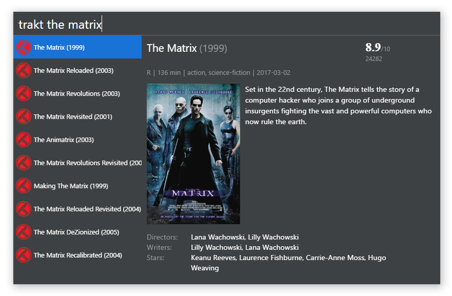

# cerebro-trakt

> [Cerebro](http://www.cerebroapp.com) plugin to find movies and shows on trakt.tv

## Usage

In Cerebro, type `trakt ` + your search query. All found movies and shows will be shown in results pane and you can see more details, when you select any of the results.

## Features

* Search for movies and shows on trakt.tv
* Show preview with more details: poster, rating, description

## Related

- [Cerebro](http://github.com/KELiON/cerebro) – main repo for Cerebro app
- [cerebro-imdb](https://github.com/KELiON/cerebro-imdb) – served as a base
- [Trakt.tv](http://trakt.tv) – the provider
- [vankasteelj/trakt.tv](https://github.com/vankasteelj/trakt.tv) – API wrapper for trakt

## License

MIT © [Ákos Resch](https://github.com/ocreaper)
